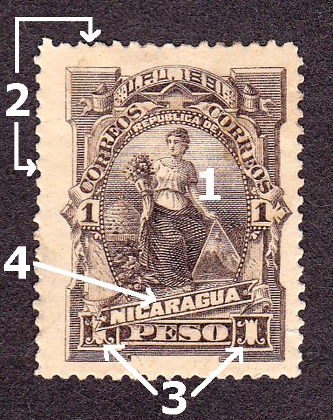

<br>

# Pandoc Monospace Web

This is a simple Pandoc based Static Site Generator
based on the Monospace Web project by Oskar Wickström.

1. Install pandoc 
2. Drop Markdown files in the src directory
3. Execute the convert.sh script
4. Deploy the build directory to your static site host

Given that the site generator consits of a single bash script, 
single html template and a css file, it's easy to customize.

All changes to the original project are unlicensed (C0).
The Monospace Web is licensed under the MIT license.

<hr class="thin">

This is a demo page showcasing all the available styles for the Pandoc Monospace Web.
All standard Pandoc markdown features are supported [^1].

See the footer for "blog" implementation idea.

- Github repository: [frainfreeze/the-monospace-web-pandoc](https://github.com/frainfreeze/the-monospace-web-pandoc)
- Original author GitHub: [owickstrom/the-monospace-web](https://github.com/owickstrom/the-monospace-web)

<hr class="thin">

## Typography

# H1 Heading (Uppercase)
## H2 Heading (Uppercase)
### H3 Heading
#### H4 Heading
##### H5 Heading
###### H6 Heading

Regular paragraph with **bold text**, *italic text*, and `inline code`. Here's a [link to somewhere](https://example.com).

Text with a sub<sub>script</sub>.

## Horizontal Rules

Default horizontal rule:

<hr>

Thin variant:

<hr class="thin">

## Lists

Unordered list:

* Item one
* Item two
* Item three
    * Nested item
    * Another nested item

Ordered list:

1. First item
2. Second item
    1. Nested numbered
    2. Another nested
3. Third item

Tree view:

<ul class="tree"><li><p style="margin: 0;"><strong>/dev/nvme0n1p2</strong></p>

* usr                               
    * local                         
    * share                         
    * libexec                       
    * include                       
    * sbin                          
    * src                           
    * lib64                         
    * lib                           
    * bin                           
    * games                         
        * solitaire
        * snake
        * tic-tac-toe
    * media                         
* media                             
* run                               
* tmp                               

</li></ul>


## Tables

We can use regular tables that automatically adjust to the monospace grid.
They're responsive. 

<table>
<thead>
  <tr>
    <th class="width-min">Name</th>
    <th class="width-auto">Dimensions</th>
    <th class="width-min">Position</th>
  </tr>
</thead>
<tbody>
  <tr>
    <td>Boboli Obelisk</td>
    <td>1.41m &times; 1.41m &times; 4.87m</td>
    <td>43°45'50.78"N 11°15'3.34"E</td>
  </tr>
  <tr>
    <td>Pyramid of Khafre</td>
    <td>215.25m &times; 215.25m &times; 136.4m</td>
    <td>29°58'34"N 31°07'51"E</td>
  </tr>
</tbody>
</table>

Note that only one column is allowed to grow.

## Forms

Here are some buttons:

<nav>
    <button>Reset</button>
    <button>Save</button>
</nav>

And inputs:

<form>
    <label>First name <input type="text" placeholder="Placeholder..." /></label>
    <label>Age <input type="text" value="30" /></label>
    <label>Disabled Input <input type="text" disabled value="Can't edit" /></label>
</form>

### Radio & Checkboxes
<form class="grid">
    <label><input type="checkbox" /> Checkbox Option</label>
    <label><input type="radio" name="group1" /> Radio 1</label>
    <label><input type="radio" name="group1" /> Radio 2</label>
</form>

## Grids

Add the `grid` class to a container to divide up the horizontal space evenly for the cells.
Note that it maintains the monospace, so the total width might not be 100%.
Here are six grids with increasing cell count:

<div class="grid"><input readonly value="1" /></div>
<div class="grid"><input readonly value="1" /><input readonly value="2" /></div>
<div class="grid"><input readonly value="1" /><input readonly value="2" /><input readonly value="3" /></div>
<div class="grid"><input readonly value="1" /><input readonly value="2" /><input readonly value="3" /><input readonly value="4" /></div>
<div class="grid"><input readonly value="1" /><input readonly value="2" /><input readonly value="3" /><input readonly value="4" /><input readonly value="5" /></div>
<div class="grid"><input readonly value="1" /><input readonly value="2" /><input readonly value="3" /><input readonly value="4" /><input readonly value="5" /><input readonly value="6" /></div>

If we want one cell to fill the remainder, we set `flex-grow: 1;` for that particular cell.

<div class="grid"><input readonly value="1" /><input readonly value="2" /><input readonly value="3!" style="flex-grow: 1;" /><input readonly value="4" /><input readonly value="5" /><input readonly value="6" /></div>

## Code Blocks

Inline code: `const example = "hello world";`

Fenced code block:

```javascript
function demo() {
  return {
    hello: "world",
    number: 42
  };
}
```


## Blockquotes

> This is a blockquote
> It can span multiple lines
> And can contain *formatted* **text**

> Nested blockquotes
>> Are also possible
>>> And can go deeper

## Details/Summary

<details>
<summary>Click to expand</summary>
<p>Hidden content goes here</p>
<p>Can contain any other elements</p>
</details>


## ASCII Art & Diagrams

We can draw in `<pre>` tags using [box-drawing characters](https://en.wikipedia.org/wiki/Box-drawing_characters):

```
╭─────────────────╮
│ MONOSPACE ROCKS │
╰─────────────────╯
```

To have it stand out a bit more, we can wrap it in a `<figure>` tag, and why not also add a `<figcaption>`.

<figure>
<pre>
┌───────┐ ┌───────┐ ┌───────┐
│Actor 1│ │Actor 2│ │Actor 3│
└───┬───┘ └───┬───┘ └───┬───┘
    │         │         │    
    │         │  msg 1  │    
    │         │────────►│    
    │         │         │    
    │  msg 2  │         │    
    │────────►│         │    
┌───┴───┐ ┌───┴───┐ ┌───┴───┐
│Actor 1│ │Actor 2│ │Actor 3│
└───────┘ └───────┘ └───────┘</pre>
<figcaption>Example: Message passing.</figcaption>
</figure>

Let's go wild and draw a chart!

<figure><pre>
                      Things I Have
                                              
    │                                     ████ Usable
15  │
    │                                     ░░░░ Broken
    │
12  │             ░            
    │             ░            
    │   ░         ░              
 9  │   ░         ░              
    │   ░         ░              
    │   ░         ░                    ░
 6  │   █         ░         ░          ░
    │   █         ░         ░          ░
    │   █         ░         █          ░
 3  │   █         █         █          ░
    │   █         █         █          ░
    │   █         █         █          ░
 0  └───▀─────────▀─────────▀──────────▀─────────────
      Socks     Jeans     Shirts   USB Drives
</pre></figure>


## Product Cards

Product cards are useful for displaying items with images, descriptions, and actions:

<div class="product-card">
  
  <h3>Product Title</h3>
  <p>This is a description of the product with all its amazing features.</p>
  <table>
    <tr>
      <th>Price</th>
      <td>$99.99</td>
    </tr>
    <tr>
      <th>Rating</th>
      <td>★★★★☆</td>
    </tr>
  </table>
  <nav>
    <a href="#">Details</a>
    <a href="#">Buy Now</a>
  </nav>
</div>

## Media with Captions

Media objects are supported, like images and video with captions:


They extend to the width of the page, and add appropriate padding in the bottom to maintain the monospace grid.


<video src="https://upload.wikimedia.org/wikipedia/commons/e/e0/The_Center_of_the_Web_%281914%29.webm" controls></video>

### Theme-Aware Images

Images can adapt to light and dark themes (convert theme using lightbulb icon in the footer or system settings):

<div class="grid">



</div>


[^1]: Pandoc understands an extended and slightly revised version of John Gruber’s Markdown syntax. See [Pandoc’s Markdown](https://pandoc.org/chunkedhtml-demo/8-pandocs-markdown.html) for details.
